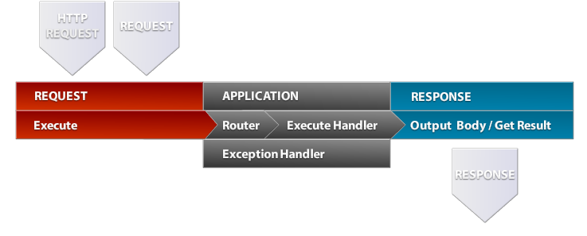

# Triad PHP Framework

Triad PHP Framework is PHP 5.3 framework handling (HTTP or other) requests to your application that
results in response - json, php serialized, raw, template engine - smarty or custom.

This framework was done with simplicity in mind - basically it handles requests and handling exceptions. 
Custom classes (database or template engine) can be easily implemented in application 
and this framework is not trying to implement custom database or template engine class - 
instead, use the one you like the most! 

Router can handle simple requests or MVP application at full - and you can easily create inline requests 
in your application (this Framework is HMVP - check
[HMVC](http://en.wikipedia.org/wiki/Hierarchical_model%E2%80%93view%E2%80%93controller) as reference) - even
to remote server. 

# Prerequisites
- PHP 5.3 or better (for namespace support)

# Requests and responses



### Request 
Request `\Triad\Request` consists of 
- `method` - `create`, `read`, `update`, `delete`
- `path` (string with full path /site-path)
- `params` (dictionary array with params)

Request can be defined 
```php
$request = new \Triad\Request("/users/get");
$request->setParams(array("params" => 1));
$request->setMethod(\Triad\RequestMethod::READ);
```
```php
$request = \Triad\Request::factory("/users/get", array("params" => 1));
```

or created from http request 
```php
$request = \Triad\Requests\HttpRequest::fromServerRequest();
```

### Response 
Response is dictionary with values that contain own serializing method `outputBody` and return method `get`. 
Build in responses are 
- `\Triad\Responses\JsonResponse`
- `\Triad\Responses\PhpSerializeResponse`
- `\Triad\Responses\RawResponse`
- `\Triad\Responses\RedirectResponse`

To obtain final response after application execution
```php
$response = $request->execute($application)->response;
```

Response can be outputed with output buffer (php print) or returned
```php
$response->send(); // output
var_dump($response->get()); // return
```

### Summary
Internal calls in same application are called as easy as 
```php
$created = \Triad\Request::factory("/users/create", array("email" => "john@doe.com"))
           ->execute($this->application)
           ->response
           ->get();
```

Calls to remote application running on remote http server are done using `\Triad\RemoteApplication` as  
```php
$remoteServer = \Triad\RemoteApplication::factory(array(
   "url" => "http://server02",
   "base_path" => "/", 
   "client_secret" => "" // if remote application client_secret set in config
));

$userData = \Triad\Request::factory("/users/get", array("id" => 1))
            ->execute($remoteServer)
            ->response
            ->get();
```

# Application
To create a new application, implement own Application class that extends `\Triad\Application` 

`index.php`
```php
<?php
require("Triad/Load.php");

class Application extends \Triad\Application
{
    public function init() {
        // set up routes
        $router = new \Triad\Router();
        
        // simple route that matches /increment-[number] 
        $router->add("#^/increment-(?P<number_to_increment>\d+)#", 
            array($this, "myCustomHandler"), 
            true // regex matching enabled
        ); 
        
        $this->setRouter($router);
    }

    public function myCustomHandler(Application $application, 
        \Triad\Request $request, 
        $params = array()) {
        $request->response["number"] = $params["number_to_increment"] + 1;
    }

    public function handleException(\Exception $e, \Triad\Request $request) {
    	var_dump($e); 
    }
}

$config = \Triad\Config::factory(__DIR__ . "/config.php");
$application = new Application($config);

// default response type
$response = new \Triad\Responses\JsonResponse(); 

$request = \Triad\Requests\HttpRequest::fromServerRequest($response);
$request->execute($application)->response->send();
```

`config.php` containing your app settings 
```php
<?php
return array(
    "base_path" => "/", 
    "environment" => "development", 
    "client_secret" => null
);
```

`.htaccess` mod rewrite settings
```
<IfModule mod_rewrite.c>
    RewriteEngine On
    # RewriteBase /

    # front controller
    RewriteCond %{REQUEST_FILENAME} !-f
    RewriteCond %{REQUEST_FILENAME} !-d
    RewriteRule .* index.php [L]
</IfModule>
```

### Full examples
Check examples of full applications that follow MVP, PHP namespaces and dependency injection design patterns. 
[Examples](https://github.com/triadphp/examples)

## Author
- [Marek Vavrecan](mailto:vavrecan@gmail.com)
- [Donate by PayPal](https://www.paypal.com/cgi-bin/webscr?cmd=_donations&business=DX479UBWGSMUG&lc=US&item_name=PHP%20Triad&currency_code=USD&bn=PP%2dDonationsBF%3abtn_donateCC_LG%2egif%3aNonHosted)

## License
- [GNU General Public License, version 3](http://www.gnu.org/licenses/gpl-3.0.html)
